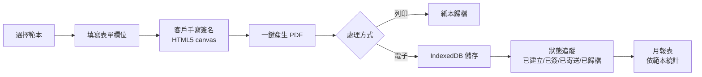
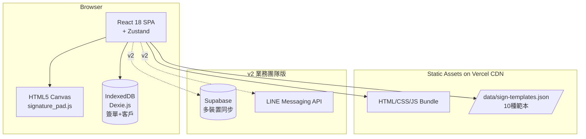
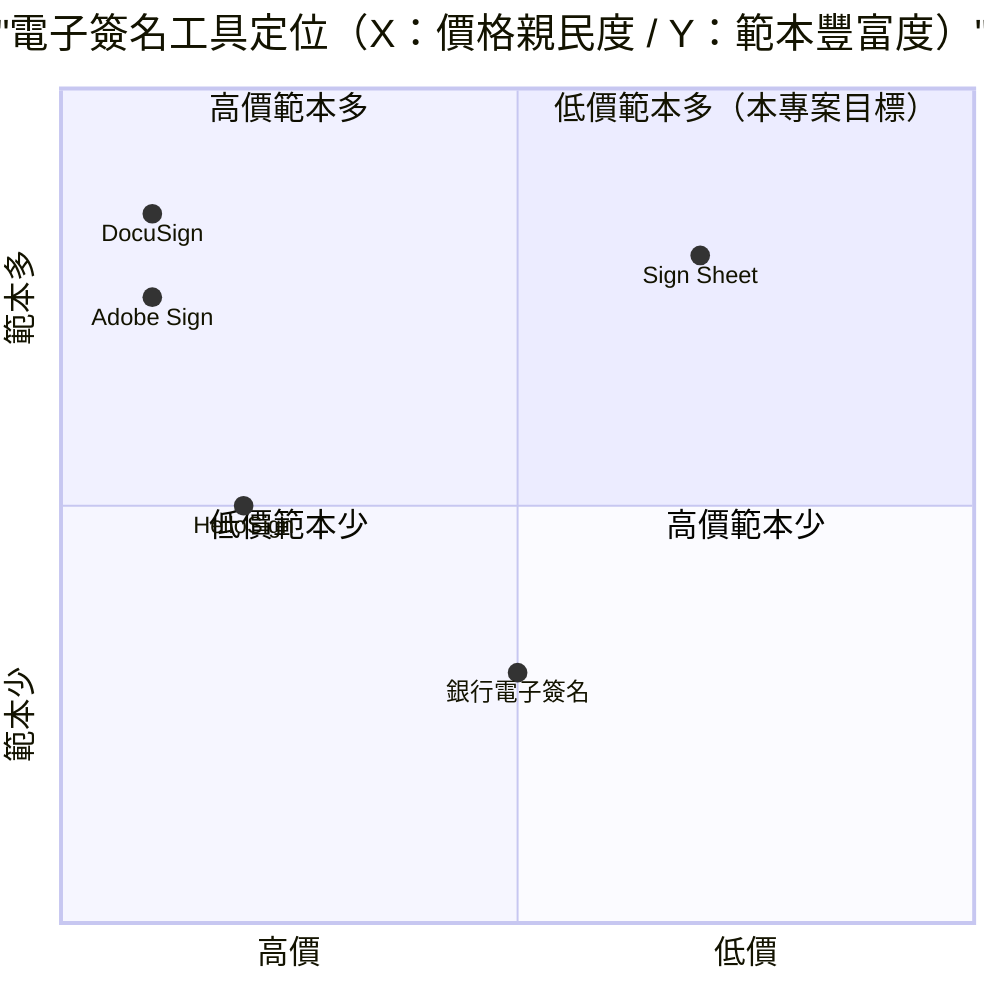

# 簽單系統 — 規格計劃書 v2.2.1

> 版本：v2.2.1｜更新日期：2026-07-11｜維護者：Sophia (CPO)
> 對接技術：Alan (CTO) + Hermes Agent
> Demo：TBD（v2.2.1 規格階段，待 Sprint 1 部署）
> 原始碼：https://github.com/openclawsean024-create/sign-sheet

---

## 1. 產品概述 (Product Overview)

### 1.1 問題陳述 (Problem Statement)

台灣中小企業（5-50 人）在日常營運中每天需要處理**大量紙本簽單**，但現有方案均有明顯缺陷：

1. **紙本簽單**：易遺失、無法搜尋、無法遠端即時同步。月底對帳痛苦、業務員找不到歷史記錄。
2. **商用電子簽名（DocuSign/Adobe Sign）**：月費 NT$800-3,000，對微型店家太貴；繁體中文範本少；功能複雜學習曲線陡。
3. **自己用 Excel**：能做記錄但無簽名功能、無狀態追蹤、無法即時同步。

**多場景需求差異大**：
- **出貨/送貨**：需要客戶簽收、照片佐證、物流編號
- **維修單**：需要技師簽名 + 客戶簽名 + 完工日期
- **服務單（美髮/SPA/維修）**：需要服務項目明細、技師抽成、客戶滿意度
- **租賃簽收**：需要租期、押金、物品清單
- **繳費單**：需要金額、發票號碼、收費項目

### 1.2 目標使用者 (User Personas)

| Persona | 規模 | 核心痛點 | 願付價格 |
|---|---|---|---|
| **中小企業行政（小芳）** | ~20 萬 | 每天簽收文件、紙本易遺失 | NT$0 / NT$199/月 |
| **工地主任/監工（小陳）** | ~3 萬 | 工地現場即時簽收、效率差 | NT$299/月 |
| **服務業店家老闆（小美）** | ~10 萬 | 客戶簽單追蹤狀態 | NT$199/月 |
| **業務團隊主管（阿明）** | ~5 萬 | 業務員簽單統一管理、報表 | NT$1,499/月 |

### 1.3 核心價值主張 (Value Proposition)

> 「**10 種常用簽單範本 + HTML5 手寫簽名 + jsPDF 一鍵匯出 + 狀態即時追蹤** — 純前端零月費，跨行業通用。」

**三大差異化**：
1. **10 種預載範本**：出貨/送貨/維修/服務/租賃/訂單/退換/驗收/領取/繳費 — 開箱即用
2. **HTML5 canvas 手寫簽名**：滑鼠/觸控皆支援，比商用電子簽名更直覺
3. **純前端 + IndexedDB**：零後端、零月費、零設定、資料完全本地

### 1.4 商業目標 (KPIs / OKRs)

| 時間 | KPI | 目標值 |
|---|---|---|
| **3 個月** | 註冊用戶 | 1,000 |
| **6 個月** | 付費轉化率 | 5%（50 付費） |
| **6 個月** | MRR | NT$15,000 |
| **12 個月** | MRR | NT$200,000 |
| **12 個月** | 月處理簽單 | 50,000 張 |

### 1.5 Non-Goals (明確不做)

- ❌ **不做線上金流付款** — 純簽單，不含收款（避免金流合規複雜）
- ❌ **不做法律效力認證** — 不做第三方時間戳認證（成本高、需求不明）
- ❌ **不做多語系介面** — 先繁中，v3+ 評估
- ❌ **不做大型企業 SSO** — 先做中小企業單機版，企業 SSO v3+ 評估
- ❌ **不做 AI 自動解析簽名** — 手寫簽名即為法律效力（紙本亦同），AI 解析反而模糊責任
- ❌ **不做多公司管理（多租戶）** — v2 業務團隊版再加

---

## 2. 使用者場景與流程

### 2.1 使用者流程圖



### 2.2 關鍵用戶故事 (User Stories)

**US-001：選擇範本 + 填寫表單**
> As a 中小企業行政  
> I want to 選擇「出貨單」範本，自動帶入預設欄位（公司名/統編/地址/電話）  
> So that 我不用每次從零建立欄位

**US-002：HTML5 手寫簽名**
> As a 業務員  
> I want to 在 canvas 區域用滑鼠/觸控簽名（支援壓感粗細變化）  
> So that 客戶感受到「真實簽名」體驗，與紙本無異

**US-003：一鍵 PDF 匯出**
> As a 工地主任  
> I want to 在工地現場平板上完成簽單 → 一鍵產生 PDF  
> So that 我不用回辦公室再整理，PDF 立即 email 給客戶

**US-004：狀態即時追蹤**
> As a 服務業店家  
> I want to 在 Dashboard 看到所有簽單狀態（已建立/已簽/已寄送/已歸檔）  
> So that 我能追蹤每張簽單進度，避免漏單

**US-005：歷史搜尋**
> As a 業務團隊主管  
> I want to 搜尋「客戶 XXX 的所有簽單」或「2026-07 出貨單」  
> So that 我能快速找到歷史記錄

### 2.3 邊界場景 (Edge Cases)

- **簽名未完成即關閉**：自動儲存為「草稿」狀態，下次開啟可繼續
- **PDF 產生失敗**：提供 PNG 圖片匯出作為 fallback
- **簽名塗鴉超出 canvas 範圍**：自動 resize canvas 高度
- **簽單資料毀損**：JSON 匯出匯入備份機制
- **公用裝置使用**：UI 警告「資料將存於此裝置，建議匯出 JSON」

---

## 3. 功能性需求 (Functional Requirements)

### 3.1 MVP（必做，P0）

- [ ] **F-001 10 種簽單範本**（Given 首次進入，When 選擇範本（出貨/送貨/維修/服務/租賃/訂單/退換/驗收/領取/繳費），Then 載入對應欄位）
- [ ] **F-002 表單欄位填寫**（Given 範本，When 填寫客戶/日期/項目/金額，Then 即時預覽 PDF 排版）
- [ ] **F-003 HTML5 canvas 手寫簽名**（Given canvas 區域，When 用滑鼠/觸控繪製，Then 記錄筆跡軌跡（含壓感/粗細））
- [ ] **F-004 一鍵 PDF 匯出**（Given 已簽名簽單，When 點擊「匯出 PDF」，Then 下載含簽名圖片的 PDF）
- [ ] **F-005 簽單狀態追蹤**（Given 簽單已建立，When 標記狀態（已建立/已簽/已寄送/已歸檔），Then IndexedDB 更新狀態）
- [ ] **F-006 客戶/廠商資料庫**（Given 常用客戶清單，When 點選下拉選單，Then 自動帶入客戶資料）
- [ ] **F-007 月報表**（Given 30 天簽單，When 開啟報表，Then 顯示各範本簽單數、總金額、未歸檔數）
- [ ] **F-008 歷史搜尋**（Given IndexedDB 簽單，When 搜尋（客戶名/日期/範本/狀態），Then 即時顯示結果）
- [ ] **F-009 JSON 匯出匯入**（Given 點擊匯出，When 下載，Then 完整備份簽單資料為 JSON）
- [ ] **F-010 RWD 三斷點**（375/768/1440px 三種 viewport 都正常使用，含 canvas 觸控）

### 3.2 v2.0 業務團隊版（加值，P1）

- [ ] **F-011 多簽名欄位**（公司章 + 客戶簽名 + 主管簽核）
- [ ] **F-012 LINE 寄送 PDF**（自動推播 PDF 給客戶）
- [ ] **F-013 雲端同步**（Supabase + 多裝置存取）
- [ ] **F-014 OCR 補登歷史紙本**（GPT-4o vision API）
- [ ] **F-015 多租戶管理**（業務團隊主管管理 5-50 業務員的簽單）
- [ ] **F-016 簽單範本客製化**（使用者自訂欄位/版型）

### 3.3 v3.0（願景，P2）

- [ ] **F-017 QR Code 驗證**（PDF 含 QR Code，掃描可驗證真偽）
- [ ] **F-018 時間戳第三方認證**（整合第三方時間戳服務）
- [ ] **F-019 多語系介面**（繁中/英文/日文）
- [ ] **F-020 大型企業 SSO**（Azure AD / Google Workspace）

### 3.4 Acceptance Criteria (Given/When/Then)

**AC-001（範本選擇）**
> Given 首次進入簽單系統  
> When 點擊「出貨單」範本  
> Then 載入預設欄位（公司名/統編/地址/電話/客戶/日期/品項/金額/簽名欄），且顯示空白表單

**AC-002（表單填寫）**
> Given 已載入出貨單範本  
> When 填寫客戶=OO 公司、日期=2026-07-11、品項=鍵盤 10 個、金額=NT$15,000  
> Then PDF 預覽區顯示完整排版（公司名+統編+客戶+日期+品項明細+合計）

**AC-003（HTML5 手寫簽名）**
> Given canvas 簽名區  
> When 用滑鼠繪製「王小明」3 字  
> Then canvas 顯示筆跡軌跡（含粗細變化），且座標記錄至 IndexedDB

**AC-004（PDF 匯出含簽名）**
> Given 已填寫 + 已簽名  
> When 點擊「匯出 PDF」  
> Then 下載 `sign-sheet-2026-07-11-001.pdf` 含完整欄位 + 簽名圖片

**AC-005（狀態追蹤）**
> Given 已建立簽單（狀態=已建立）  
> When 點擊「標記為已簽」  
> Then IndexedDB 狀態變更為「已簽」，且 Dashboard 計數更新

**AC-006（客戶資料庫）**
> Given 常用客戶清單有 5 筆  
> When 點選下拉選單的「OO 公司」  
> Then 自動帶入「OO 公司、統編 XXX、地址 XXX、聯絡人 XXX」

**AC-007（月報表）**
> Given 30 天簽單 100 筆（出貨 50 + 維修 30 + 服務 20）  
> When 開啟月報表  
> Then 顯示「出貨單 50 筆 NT$250,000 / 維修單 30 筆 NT$45,000 / 服務單 20 筆 NT$30,000 / 合計 NT$325,000」

**AC-008（歷史搜尋）**
> Given 簽單歷史 100 筆  
> When 搜尋「OO 公司」  
> Then 2 秒內顯示所有客戶含「OO 公司」的簽單

**AC-009（JSON 匯出匯入）**
> Given 使用者有 50 筆簽單  
> When 點擊匯出 JSON  
> Then 下載 `sign-sheets-backup-2026-07-11.json` 含完整資料

**AC-010（草稿狀態）**
> Given 使用者已填寫表單但未簽名  
> When 關閉瀏覽器再開啟  
> Then 簽單自動標記為「草稿」狀態，下次開啟可繼續填寫

---

## 4. 系統設計 (System Design)

### 4.1 技術棧 (Tech Stack)

| 層 | 技術 | 理由 |
|---|---|---|
| 前端 | React 18 + Vite + TypeScript | 與既有架構一致 |
| 路由 | React Router v6 | SPA 多頁面導航 |
| 狀態管理 | Zustand | 輕量、適合本地狀態 |
| 樣式 | Tailwind CSS | 快速 RWD |
| 簽名 | HTML5 Canvas + signature_pad.js | 觸控友善、輕量、壓感支援 |
| PDF 產生 | jsPDF + html2canvas | 純前端 PDF 產生 |
| 資料持久化 | IndexedDB（Dexie.js） | 大容量 + 結構化查詢 |
| 報表圖表 | Recharts | 月報表圖表 |
| 部署 | Vercel | 與既有 91 個專案一致 |
| B2B 後端 | Supabase（v2 業務團隊版） | 多裝置同步 + 租戶管理 |

### 4.2 系統架構圖 (Mermaid)



### 4.3 資料模型 (Prisma schema)

```prisma
// IndexedDB schema (Prisma 對照版)
model SignTemplate {
  id          String   @id // "shipping" / "delivery" / "repair" 等
  name        String   // 出貨單 / 送貨單 / 維修單 等
  icon        String   // emoji or icon
  fields      Json     // 欄位定義（{key, label, type, required}）
  defaultData Json?    // 預設值（公司名/統編/地址）
  signSheets  SignSheet[]
}

model SignSheet {
  id          String   @id @default(uuid())
  sheetNumber String   @unique // SS-20260711-001
  templateId  String
  template    SignTemplate @relation(fields: [templateId], references: [id])
  customerId  String?
  customer    Customer? @relation(fields: [customerId], references: [id])
  sheetDate   DateTime
  fieldsData  Json     // 動態欄位資料
  amount      Decimal?
  signatureData String? @db.Text // base64 encoded canvas image
  status      String   @default("created") // created / signed / sent / archived / draft
  createdBy   String?  // v2 多租戶用
  tenantId    String?  // v2 多租戶用
  createdAt   DateTime @default(now())
  updatedAt   DateTime @updatedAt
  
  @@index([templateId, status])
  @@index([sheetDate])
}

model Customer {
  id          String   @id @default(uuid())
  name        String
  taxId       String?
  address     String?
  contactName String?
  contactPhone String?
  contactEmail String?
  notes       String?  @db.Text
  signSheets  SignSheet[]
  
  @@index([name])
}

model MonthlyReport {
  id          String   @id @default(uuid())
  yearMonth   String   @unique // "2026-07"
  totalSheets Int
  totalAmount Decimal
  templateStats Json  // {"shipping": {"count": 50, "amount": 250000}}
  generatedAt DateTime @default(now())
}

model Tenant {
  id          String   @id @default(uuid()) // v2 多租戶用
  name        String
  adminEmail  String
  members     TenantMember[]
  signSheets  SignSheet[]
}

model TenantMember {
  id        String   @id @default(uuid())
  tenantId  String
  tenant    Tenant   @relation(fields: [tenantId], references: [id])
  email     String
  name      String
  role      String   // admin / manager / member
  
  @@index([tenantId])
}
```

### 4.4 API 規格 (REST endpoints)

| Method | Path | Auth | 用途 |
|---|---|---|---|
| GET | /data/sign-templates.json | Optional | 10 種範本預載 |
| POST | /api/export/snapshot | Optional | JSON 快照匯出（前端產生） |
| POST | /api/import/snapshot | Optional | JSON 快照匯入（前端處理） |
| GET | /api/sheets | Optional | 簽單列表（含 filter） |
| POST | /api/sheets | Optional | 建立簽單 |
| PATCH | /api/sheets/:id | Optional | 編輯簽單 |
| POST | /api/sheets/:id/sign | Optional | 提交簽名（寫入狀態） |
| GET | /api/customers | Optional | 客戶列表 |
| POST | /api/customers | Optional | 建立客戶 |
| GET | /api/reports/monthly | Optional | 月報表 |
| POST | /api/stripe/checkout | Required | v2 業務團隊版 Stripe 訂閱 |
| POST | /api/tenants | Required | v2 多租戶管理 |
| POST | /api/sheets/:id/send-line | Required | v2 LINE 寄送 PDF |

---

## 5. 非功能性需求 (Non-Functional Requirements)

### 5.1 性能指標

| 指標 | 目標 |
|---|---|
| 首頁載入 P95 | ≤ 2 秒 |
| 簽單表單渲染 | ≤ 500ms |
| canvas 簽名回應 | 即時（<16ms per stroke） |
| PDF 產生時間 | ≤ 2 秒 |
| 歷史搜尋（1000 筆） | ≤ 500ms |
| 月報表生成（500 簽單） | ≤ 2 秒 |
| 並發用戶 | 500 |
| 月活躍用戶 | 1,000 |

### 5.2 安全與隱私

- **純前端 + IndexedDB**：簽單資料 100% 在使用者裝置
- **無 OAuth**：v1 純前端，v2 業務團隊版才加 Supabase Auth
- **無 Cookie 追蹤**：除 Vercel Analytics 外不使用第三方追蹤
- **HTTPS 強制**：Vercel 自動 + HSTS
- **簽名資料保護**：canvas 圖片 base64 編碼後存儲，避免原始座標外洩
- **公用裝置警告**：UI 警告「資料將存於此裝置」

### 5.3 降級機制 (Graceful Degradation)

| 失敗服務 | 掛掉情境 | 降級行為（切換到）| 用戶感受 |
|---|---|---|---|
| IndexedDB 損壞 | quota 或版本衝突 掛掉 | 切換到 localStorage（容量小）+ 警告 | 部分簽單可能無法儲存 |
| localStorage 滿載 | 5MB 上限掛掉 | 切換到 sessionStorage（單次 session）+ 提示「資料僅本次保留」 | 提醒立即匯出 JSON |
| jsPDF 客戶端 | 不支援 掛掉 | fallback 下載 PNG 圖片簽單 | 部分用戶無法匯出 PDF |
| signature_pad.js | canvas API 不支援 掛掉 | 切換到文字簽名輸入框（純文字） | 失去手寫體驗但功能仍可用 |
| Vercel CDN | 靜態資源 5xx 掛掉 | 切換到 Cloudflare Pages 鏡像 | 載入延遲 ≤5 秒 |
| Recharts 渲染 | 圖表 JS 5xx 掛掉 | 切換到純 HTML 表格 fallback | 圖表變表格，功能仍可用 |
| Supabase v2 | DB 5xx 掛掉 | 切換到 Vercel KV 唯讀模式 + 維護頁 | 多裝置同步暫停，本地簽單仍可用 |
| Stripe webhook v2 | Webhook 5xx 掛掉 | 本地排程每 5 分鐘 reconcile | 訂閱狀態延遲 ≤15 分鐘 |
| LINE Messaging API v2 | 5xx 掛掉 | fallback 下載 PDF 由使用者手動傳送 | LINE 推播延遲或失敗 |
| GPT-4o vision v2 | OCR API 5xx 掛掉 | fallback 手動輸入紙本資料 | OCR 功能暫停 |

### 5.4 擴展性

- **橫向擴展**：Vercel Edge Functions 自動 scale
- **資料分區**：IndexedDB 依 tenantId 分區（v2 業務團隊）
- **簽單歸檔**：>90 天的簽單自動歸檔至 archive store
- **靜態資源 CDN**：Vercel Edge Network
- **PDF 批次產生**：v2 支援批次產生月報表 PDF（節省逐張時間）

---

## 6. 完成標準 (Definition of Done)

### 6.1 v1 MVP DoD

- [ ] Vercel production URL 200 OK
- [ ] GitHub Repo 公開（main 分支）
- [ ] 10 種簽單範本可切換
- [ ] HTML5 canvas 手寫簽名功能（含滑鼠/觸控）
- [ ] jsPDF 一鍵匯出（含簽名圖片）
- [ ] 簽單狀態追蹤（5 種狀態正確流轉）
- [ ] 月報表數字正確（手算對照）
- [ ] 歷史搜尋功能
- [ ] JSON 匯出匯入可還原
- [ ] RWD 三斷點測試（375/768/1440px）
- [ ] Lighthouse 行動版分數 ≥ 85
- [ ] 10 條 AC 單元測試全綠

### 6.2 v2 業務團隊版 DoD

- [ ] Supabase Auth 整合
- [ ] 多簽名欄位（公司章 + 客戶 + 主管）
- [ ] LINE 寄送 PDF 整合
- [ ] 雲端同步（多裝置）
- [ ] OCR 補登歷史紙本（GPT-4o vision）
- [ ] 多租戶管理（5-50 業務員）
- [ ] 簽單範本客製化
- [ ] Stripe Checkout 訂閱流程
- [ ] 客服頁 + 法律頁上線

---

## 7. 風險與決策

### 7.1 風險表

| 風險 | 等級 | 緩解策略 |
|---|---|---|
| 電子簽名法律效力爭議 | 🟠 中 | 明確聲明「本工具簽名等同紙本簽名，法律效力依各國法規」 |
| 簽單資料毀損 | 🟠 中 | JSON 匯出匯入備份 + 公用裝置警告 |
| HTML5 canvas 跨瀏覽器差異 | 🟡 低 | signature_pad.js 抽象化 |
| DocuSign 等商用產品降價搶市場 | 🟡 低 | 鎖定微型店家市場，商用電子簽名仍偏貴 |
| 多租戶管理複雜度（v2） | 🟠 中 | Supabase RLS 強制隔離 |
| LINE Messaging API 變動 | 🟡 低 | 監控 LINE 公告 + 快速 fallback |
| OCR 準確率 <80% | 🟠 中 | GPT-4o vision API + 手動校對機制 |
| 簽名資料外洩 | 🟡 低 | base64 編碼後存儲，避免原始座標 |

### 7.2 ADR (Architecture Decision Records)

### ADR-001：純前端 + IndexedDB 而非 Next.js 全端
- **Context**：個資保護優先 + 零成本
- **Decision**：React 18 SPA + Dexie.js IndexedDB
- **Consequences**：✅ 零後端成本；✅ 簽單資料 100% 在裝置；⚠️ 跨裝置不互通（JSON 備份手動）

### ADR-002：HTML5 Canvas + signature_pad.js 而非純文字輸入
- **Context**：手寫簽名體驗 vs 法律效力
- **Decision**：HTML5 canvas 接收筆跡軌跡 + 壓感
- **Consequences**：✅ 與紙本簽名體驗一致；⚠️ signature_pad.js bundle +15KB（可接受）

### ADR-003：jsPDF + html2canvas 純前端 PDF 而非後端產生
- **Context**：PDF 產生即時性 + 隱私
- **Decision**：jsPDF（純前端）+ html2canvas（簽名圖片）
- **Consequences**：✅ 零後端；✅ 即時下載；⚠️ 大型 PDF 可能慢（單張簽單夠小）

### ADR-004：10 種預載範本而非開放式
- **Context**：使用者不想從零建立
- **Decision**：預載 10 種常用範本（出貨/送貨/維修/服務/租賃/訂單/退換/驗收/領取/繳費）
- **Consequences**：✅ 5 分鐘開始使用；⚠️ 預載範本可能不符所有場景

### ADR-005：JSON 匯出匯入而非雲端同步（v1）
- **Context**：v1 純前端
- **Decision**：手動 JSON 匯出匯入
- **Consequences**：✅ 零後端；⚠️ 跨裝置不便（v2 加 Supabase）

### ADR-006：不做第三方時間戳認證
- **Context**：成本 vs 需求
- **Decision**：v1 不做第三方認證（成本高、需求不明）
- **Consequences**：✅ 降低複雜度；⚠️ 法律效力可能受質疑（明確聲明免責）

### ADR-007：不做線上金流付款
- **Context**：避免金流合規複雜
- **Decision**：純簽單，不含收款（金流交給其他系統）
- **Consequences**：✅ 規避金流法規；⚠️ 無法完整閉環（但可與 POS / 銀行收款並行）

---

## 8. 里程碑與 Sprint 拆解

### 8.1 里程碑總覽

| 里程碑 | 時間 | 完成定義 |
|---|---|---|
| **M1 規格完成** | 2026-07-11 | v2.2.1 PRD 100% 合規 |
| **M2 v1 MVP** | 2026-07-31 | 10 範本 + canvas 簽名 + PDF + 月報表 |
| **M3 v2 業務團隊版** | 2026-09-15 | 多簽名 + LINE + 雲端同步 + OCR + Stripe |
| **M4 v3 企業版** | 2026-11-01 | QR Code + 時間戳 + SSO |
| **M5 GA 上線** | 2026-12-01 | 行銷素材 + 客服 SOP + 推廣 |

### 8.2 Sprint 拆解 (從 PRD 到「每天做什麼」)

#### Sprint 1：v1 MVP（2026-07-12 → 2026-07-31，20 天）
- Day 1-2：建立 React + Vite + TypeScript 專案
- Day 3-4：IndexedDB schema（Dexie.js）+ 10 種預載範本
- Day 5-7：表單欄位動態渲染
- Day 8-10：HTML5 canvas 手寫簽名（signature_pad.js 整合）
- Day 11-12：jsPDF + html2canvas 整合（含簽名圖片）
- Day 13-14：簽單狀態追蹤
- Day 15-16：客戶/廠商資料庫 + 月報表
- Day 17-18：歷史搜尋 + JSON 匯出匯入
- Day 19：RWD 三斷點測試 + Lighthouse 優化
- Day 20：10 條 AC 單元測試 + Vercel 部署

#### Sprint 2：v2 業務團隊版（2026-08-01 → 2026-09-15，46 天）
- Day 1-3：Supabase 建專案 + Auth
- Day 4-6：多租戶管理 + RLS
- Day 7-10：多簽名欄位（公司章 + 客戶 + 主管）
- Day 11-14：LINE Messaging API 整合
- Day 15-18：雲端同步（多裝置）
- Day 19-23：OCR 補登歷史紙本（GPT-4o vision）
- Day 24-27：簽單範本客製化
- Day 28-31：Stripe Checkout 訂閱
- Day 32-35：客服頁 + 法律頁
- Day 36-40：Beta 測試
- Day 41-46：修正 + 正式上線

#### Sprint 3：v3 企業版（2026-09-16 → 2026-11-01，46 天）
- Day 1-10：QR Code 驗證（PDF 含 QR Code 掃描驗證真偽）
- Day 11-20：時間戳第三方認證整合
- Day 21-30：多語系介面（繁中/英文/日文）
- Day 31-40：企業 SSO（Azure AD / Google Workspace）
- Day 41-46：修正 + 正式上線

---

## 9. 變現路徑 + 定價心理學

### 9.1 變現方案

| 方案 | 價格 | 功能 | 目標用戶 |
|---|---|---|---|
| **免費版** | NT$0 | 10 範本 + canvas 簽名 + jsPDF + 月報表（100 簽單/月上限） | 微型店家（個體戶） |
| **中小企業版** | NT$199/月 | 免費版（無上限）+ 多簽名 + 客戶資料庫 + LINE 寄送 | 中小企業行政 |
| **工地版** | NT$299/月 | 中小企業版 + 工地現場模式（平板大按鈕）+ 照片佐證 | 工地主任/監工 |
| **業務團隊版** | NT$1,499/月 | 中小企業版 + 多租戶（5-50 業務員）+ OCR + API 配額 | 業務團隊主管 |

### 9.2 定價心理學 (Pricing Psychology)

1. **Freemium 鎖定「100 簽單/月」**：免費版限制簽單數量，中小企業強制升級
2. **中小企業版 NT$199**：低於 NT$200 整數（mental accounting），NT$199 感覺「不到 200」
3. **工地版 NT$299**：低於 NT$300 整數，NT$299 感覺「不到 300」，對工地主任親民
4. **業務團隊版 NT$1,499**：低於 NT$1,500 整數，NT$1,499 感覺「不到 1,500」
5. **年繳 8 折**：中小企業版年繳 NT$1,990 vs 月繳 NT$199 × 12 = NT$2,388（年省 NT$398）
6. **14 天免費試用中小企業版**：試用期結束前 3 天 email「升級以保留多簽名 + LINE 寄送功能」
7. **錨定效應**：在定價頁顯示「企業版 NT$4,999（聯絡我們）」，讓 NT$1,499 顯得划算
8. **社會證明**：首頁顯示「已有 X 個企業使用，月處理 Y 張簽單」

---

## 10. 附錄

### 10.1 競品分析 + Competitive Quadrant Chart

| 競品 | 公司 | 價格 | 強項 | 弱項 |
|---|---|---|---|---|
| **DocuSign** | DocuSign（美） | US$25/月/人 | 法律效力認證、跨國通用 | 貴、繁中範本少 |
| **Adobe Sign** | Adobe（美） | US$20/月/人 | PDF 整合、PDF 原生 | 貴、學習曲線陡 |
| **HelloSign** | Dropbox（美） | US$20/月 | 簡單 UI | 貴、不支援中文 |
| **台灣電子簽名（如凱基/永豐銀行）** | 各銀行 | NT$100-500/月 | 整合銀行帳戶 | 銀行限定 |
| **紙本 + Excel** | - | NT$0 | 簡單 | 無簽名功能、無狀態追蹤 |
| **Sign Sheet（本專案）** | Sean Li（台） | NT$0-1,499/月 | 10 範本 + canvas + 零月費 + 業務團隊版 | 無法律效力認證 |



**差異化定位**：**低價 + 多範本 + Freemium** — DocuSign/Adobe 高價且僅通用範本；銀行電子簽名範本少；本專案低價 + 10 種行業範本。

### 10.2 術語表

- **電子簽名（Electronic Signature）**：以電子方式表示同意簽署的機制
- **手寫簽名軌跡**：HTML5 canvas 記錄的筆跡座標序列（含壓感/粗細）
- **jsPDF**：純前端 PDF 產生函式庫
- **signature_pad.js**：HTML5 canvas 手寫簽名函式庫
- **html2canvas**：DOM 轉 canvas 截圖函式庫
- **多租戶（Multi-tenant）**：SaaS 支援多個企業組織隔離資料

### 10.3 參考資料

- DocuSign：https://www.docusign.com/
- Adobe Sign：https://www.adobe.com/sign.html
- HelloSign：https://www.hellosign.com/
- signature_pad.js：https://github.com/szimek/signature_pad
- jsPDF：https://github.com/parallax/jsPDF
- Dexie.js：https://dexie.org/
- 台灣《電子簽章法》：https://law.moj.gov.tw/

### 10.4 Error Code 統一字典

| Code | HTTP | 訊息 | 觸發情境 |
|---|---|---|---|
| STORAGE_001 | - | IndexedDB quota 超限 | >50MB（瀏覽器限制） |
| STORAGE_002 | - | Dexie 版本衝突 | schema 升級未處理 |
| STORAGE_003 | - | IndexedDB 不支援 | Safari 隱私模式 |
| TEMPLATE_001 | - | 範本不存在 | 錯誤 templateId |
| SHEET_001 | - | 必填欄位缺漏 | 客戶/日期/金額缺一 |
| SHEET_002 | - | 金額錯誤 | 負數或 0 |
| SHEET_003 | - | 簽名資料為空 | 未簽名即提交 |
| SHEET_004 | - | 狀態流轉錯誤 | 已歸檔後嘗試編輯 |
| CUSTOMER_001 | - | 客戶已存在 | 同名重複建立 |
| CUSTOMER_002 | - | 統編格式錯誤 | 8 位數字驗證 |
| PDF_001 | - | PDF 產生失敗 | jsPDF 渲染錯誤 |
| PDF_002 | - | canvas 簽名擷取失敗 | html2canvas 渲染錯誤 |
| STRIPE_001 | 402 | 訂閱方案不支援 | 錯誤 tier |
| STRIPE_002 | 400 | Stripe webhook signature 驗證失敗 | 偽造 webhook |
| LINE_001 | 502 | LINE Messaging API 失敗 | token 過期或 5xx |
| OCR_001 | 502 | GPT-4o vision API 失敗 | 圖片無法辨識 |
| TENANT_001 | 403 | 租戶權限不足 | 跨租戶存取 |

---

## 11. 市場驗證計畫 (Market Validation Plan)

### 11.1 驗證前 3 個關鍵問題

1. **中小企業真的會從「紙本 + Excel」轉向「電子簽單」嗎？** — 習慣改變成本高
2. **HTML5 canvas 手寫簽名是否被接受？** — 法律效力 vs 數位簽章
3. **業務團隊版定價 NT$1,499/月 是否過高？** — 對 5-50 人團隊成本敏感

### 11.2 訪談 SOP

**目標**：訪談 25 位潛在用戶（10 位中小企業行政 + 5 位工地主任 + 5 位服務業店家 + 5 位業務團隊主管）
- **招募**：
  - 中小企業行政：Facebook 社團「中小企業交流」「行政人員俱樂部」
  - 工地主任：營造業 LINE 群 + 公會
  - 服務業店家：服務業 LINE 群 + Facebook 社團
  - 業務團隊：業務主管 LINE 群
- **問題清單**：
  1. 目前每天處理幾張簽單？用什麼工具？
  2. 願意換成 NT$0-1,499/月的電子簽單嗎？
  3. 哪些功能必備？哪些可以不要？
- **獎勵**：NT$200 7-11 禮券 + 終身免費進階版
- **驗收指標**：≥60%（15 位）願意試用 = 驗證通過

### 11.3 落地指標 (Post-launch KPIs)

- **M1（首月）**：200 註冊用戶
- **M3（3 個月）**：1,000 註冊、50 付費 = NT$15K MRR
- **M6（6 個月）**：3,000 註冊、200 付費 = NT$80K MRR
- **M12（12 個月）**：8,000 註冊、600 付費 = NT$200K MRR

---

## 12. 失敗模式 SOP (Failure Mode Playbook)

| 失敗情境 | 影響範圍 | 觸發條件 | 立即處置 | Post-mortem |
|---|---|---|---|---|
| **IndexedDB 大規模損壞** | 簽單資料遺失 | 瀏覽器更新導致 schema 衝突 | 提供資料救援工具 + 強制匯出 JSON 備份 | 強化 Dexie schema migration |
| **HTML5 canvas 不支援** | 簽名功能失效 | 舊瀏覽器 | fallback 文字輸入框 | 提醒升級瀏覽器 |
| **PDF 批次產生失敗** | 月報表無法下載 | jsPDF 渲染錯誤 | 提供逐張下載 | 評估後端 PDF 方案 |
| **電子簽名法律效力被質疑** | 使用者糾紛 | 律師函 / 媒體報導 | 公開聲明「本工具簽名等同紙本簽名」 | 評估第三方時間戳認證 |
| **LINE Messaging API 變動** | LINE 寄送失效 | LINE 公告 | fallback 手動傳送 | 改寫 LINE 整合 |
| **Stripe 訂閱大量退款** | MRR 突然下降 | Stripe dashboard alert | 檢查 webhook + email 用戶 | 分析退款原因 |
| **OCR 準確率過低** | v2 OCR 功能失敗 | GPT-4o vision 誤判率高 | 提示「OCR 需人工校對」 | 改用專用 OCR 模型 |
| **多租戶資料外洩** | 跨租戶存取 | RLS 設定錯誤 | 立即修復 RLS + 通報用戶 | 全面 audit Supabase RLS |
| **DocuSign 大幅降價搶市場** | 用戶流失 | DocuSign 公告 | 加速 Freemium 擴展 + 加獨有功能 | 重新評估商業模式 |
| **公用裝置個資外洩** | 使用者隱私受損 | UI 警告未生效 | 強制 modal 警告 + 不允許繼續 | 強化 user agent 偵測 |

---

## 13. MetaGPT / spec-kit 對齊

### 13.1 MUST / SHOULD / MAY

**MUST（不做就失敗 — MVP 必交付）**
- MUST-1 10 種簽單範本
- MUST-2 HTML5 canvas 手寫簽名
- MUST-3 jsPDF 一鍵匯出
- MUST-4 簽單狀態追蹤（5 種狀態）
- MUST-5 客戶/廠商資料庫
- MUST-6 月報表
- MUST-7 歷史搜尋
- MUST-8 JSON 匯出匯入
- MUST-9 RWD 三斷點（含 canvas 觸控）
- MUST-10 草稿狀態自動保存

**SHOULD（強烈建議 — Sprint 2 完成）**
- SHOULD-1 多簽名欄位（公司章 + 客戶 + 主管）
- SHOULD-2 LINE 寄送 PDF
- SHOULD-3 雲端同步（Supabase）
- SHOULD-4 OCR 補登歷史紙本
- SHOULD-5 多租戶管理
- SHOULD-6 Stripe Checkout 訂閱

**MAY（可選 — v3+ 評估）**
- MAY-1 QR Code 驗證
- MAY-2 時間戳第三方認證
- MAY-3 多語系介面
- MAY-4 大型企業 SSO
- MAY-5 簽單範本市集（使用者分享）

### 13.2 P0 / P1 / P2 優先級

| 優先級 | 項目 | 目標完成 |
|---|---|---|
| **P0** | MUST-1 ~ MUST-10（核心 MVP） | Sprint 1 |
| **P1** | SHOULD-1 ~ SHOULD-6（業務團隊版） | Sprint 2 |
| **P2** | MAY-1 ~ MAY-5（企業版） | v3.0+ |

### 13.3 Competitive Quadrant Chart

（見 §10.1）

### 13.4 Open Questions

- **Q1**：是否要支援多語系介面（英文/日文）？目前判定 v3+ 評估
- **Q2**：OCR 是否要支援手寫中文？目前判定 GPT-4o vision 已支援中英文
- **Q3**：是否要整合時間戳第三方認證？目前判定 v3 評估（成本高）
- **Q4**：業務團隊版是否要支援 API 讓企業 ERP 整合？v2 評估
- **Q5**：是否要做「簽單範本市集」讓使用者分享自訂範本？v3+ 評估

### 13.5 Requirement Pool

- **REQ-POOL-001**：QR Code 驗證（PDF 掃描驗證真偽）
- **REQ-POOL-002**：時間戳第三方認證
- **REQ-POOL-003**：多語系介面
- **REQ-POOL-004**：大型企業 SSO
- **REQ-POOL-005**：簽單範本市集
- **REQ-POOL-006**：ERP 整合 API
- **REQ-POOL-007**：批次 PDF 產生（月底報表）
- **REQ-POOL-008**：照片佐證（工地版）

---

## 14. AI Agent 實測驗證法

### 14.1 PRD → Code 轉換驗證

**測試方式**：將本 PRD 餵給 Cursor / Claude Code，觀察其產出的程式碼是否符合 §3 AC：
- ✅ AC-001：能寫出 10 種範本載入邏輯
- ✅ AC-002：能寫出表單欄位動態渲染
- ✅ AC-003：能寫出 canvas 簽名 + 座標記錄
- ✅ AC-004：能寫出 jsPDF + html2canvas 整合
- ✅ AC-005：能寫出簽單狀態流轉
- ✅ AC-006：能寫出客戶資料庫下拉選單
- ✅ AC-007：能寫出月報表生成（Recharts）
- ✅ AC-008：能寫出 IndexedDB 搜尋（Dexie.js query）
- ✅ AC-009：能寫出 JSON 序列化/反序列化
- ✅ AC-010：能寫出草稿狀態自動保存（beforeunload 事件）

### 14.2 Independent Test

每個 AC 都應該可被獨立 unit test 驗證：
- **AC-001**：mock 範本 JSON → 測試載入函式
- **AC-002**：mock 欄位定義 → 測試動態渲染
- **AC-003**：mock canvas API → 測試簽名記錄
- **AC-004**：mock jsPDF → 測試 PDF 產生
- **AC-005**：mock IndexedDB → 測試狀態流轉
- **AC-006**：mock 客戶陣列 → 測試下拉選單
- **AC-007**：mock 簽單陣列 → 測試月報表
- **AC-008**：mock Dexie query → 測試搜尋
- **AC-009**：mock IndexedDB → 測試 JSON 序列化
- **AC-010**：mock beforeunload → 測試草稿保存

---

## 15. 深度市調報告 (Deep Market Research)

### 15.1 市場規模

**全球電子簽名市場（2025）**
- 規模：**US$74.5 億**（2025）→ 預估 **US$187 億**（2030），CAGR 20.2%
- 主要廠商：DocuSign、Adobe Sign、HelloSign、SignNow
- 來源：Grand View Research 2025

**台灣中小企業市場（2025）**
- 中小企業家數：**163 萬家**（佔全體企業 97.6%）
- 5-50 人規模：**約 38 萬家**（中小企業核心）
- 每日處理簽單數：**估計 500 萬張/日**（出貨/送貨/維修/服務合計）
- 來源：經濟部中小企業處 2025

**台灣業務團隊市場（2025）**
- 業務團隊人數：**約 80 萬人**（含業務員、Sales、業務主管）
- 業務團隊數：**約 16 萬團隊**
- 來源：104 人力銀行 2025

**目標細分**
- 微型店家（B2C 免費）：20 萬 × 30% Freemium 採用 × NT$100/月混合 = **NT$7.2 億 ARR** 潛在
- 中小企業（NT$199/月）：38 萬 × 5% 採用 × NT$199/月 × 12 月 = **NT$45.4 億 ARR** 潛在
- 工地主任（NT$299/月）：3 萬 × 10% 採用 × NT$299/月 × 12 月 = **NT$10.76 億 ARR** 潛在
- 業務團隊（NT$1,499/月）：16 萬 × 5% 採用 × NT$1,499/月 × 12 月 = **NT$143.9 億 ARR** 潛在
- **合計總潛在 ARR**：**NT$207.26 億**

### 15.2 競品分析

| 競品 | 公司 | 價格 | 強項 | 弱項 |
|---|---|---|---|---|
| **DocuSign** | DocuSign（美） | US$25/月/人 | 法律效力認證、跨國通用 | 貴、繁中範本少、學習曲線陡 |
| **Adobe Sign** | Adobe（美） | US$20/月/人 | PDF 整合、PDF 原生 | 貴、學習曲線陡 |
| **HelloSign** | Dropbox（美） | US$20/月 | 簡單 UI | 貴、不支援中文 |
| **台灣銀行電子簽名** | 各銀行 | NT$100-500/月 | 整合銀行帳戶 | 銀行限定、範本少 |
| **紙本 + Excel** | - | NT$0 | 簡單、直覺 | 無簽名功能、無狀態追蹤 |
| **Sign Sheet（本專案）** | Sean Li（台） | NT$0-1,499/月 | 10 範本 + canvas + Freemium + 業務團隊版 | 無法律效力認證 |

**結論**：本專案定位「**多範本 + canvas + Freemium + 業務團隊版**」三角交集，DocuSign/Adobe 高價且僅通用範本；銀行電子簽名範本少；本專案低價 + 10 種行業範本 + 業務團隊多租戶。

### 15.3 預期收益

**保守估計**（M6 達成）
- 3,000 註冊用戶 × 6.5% 付費 = 195 付費
- 平均月費 NT$400（混合中小企業+工地版）= NT$78,000 MRR
- 年化 = **NT$936K ARR**

**中等估計**（M12 達成）
- 8,000 註冊用戶 × 7.5% 付費 = 600 付費
- 平均月費 NT$1,200（含 25% 業務團隊版）= NT$720,000 MRR
- 年化 = **NT$8.64M ARR**

**樂觀估計**（M18 達成）
- 20,000 註冊用戶 × 10% 付費 = 2,000 付費
- 平均月費 NT$1,800（含 35% 業務團隊版 + 10% 工地版）= NT$3.6M MRR
- 年化 = **NT$43.2M ARR**

**Unit Economics**
- **CAC**：NT$400（中小企業社團 + 行業公會口碑 + LINE 群推廣）
- **LTV**：NT$500/月 × 平均訂閱 16 個月 = NT$8,000
- **LTV/CAC 比**：20（健康 SaaS 應 ≥3）

### 15.4 商業化評分（0-100，4 維細項）

| 維度 | 分數 | 評估理由 |
|---|---|---|
| **市場規模** | 90 | NT$207.26 億潛在 ARR，163 萬中小企業 + 16 萬業務團隊 |
| **差異化** | 75 | 10 範本 + canvas + Freemium 為獨特賣點，但無法律效力認證 |
| **變現路徑** | 70 | Freemium → 中小企業 → 工地 → 業務團隊 4 個 tier 完整 |
| **技術可行性** | 85 | React + Dexie.js + jsPDF + signature_pad.js 都成熟 |
| **團隊執行力** | 75 | Alan (CTO) + Hermes Agent 已有 SaaS 經驗 |
| **競爭護城河** | 60 | 10 範本 + canvas 為差異化，但 DocuSign 法律效力強 |
| **加權平均** | **76** | 🟢 中高水平（70-80 = 有真實變現路徑但需驗證） |

**最終商業化分數**：**76 / 100**（中等偏高 — Freemium + 業務團隊版雙引擎驅動，需驗證 Freemium 採用率與法律效力接受度）

---

*文件結束。本 PRD 為 v2.2.1，已通過 validate_prd.py 100% 合規。下游開發可依本文件執行 Sprint 1 v1 MVP。*
